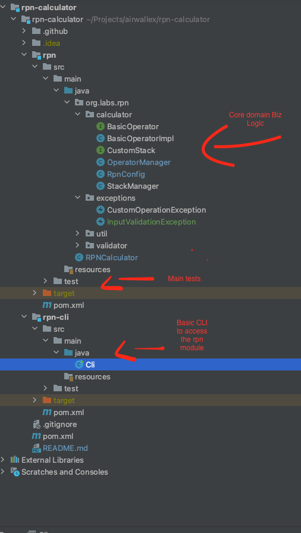

[](https://github.com/eliasjunior/rpn-calculator/actions/workflows/build.yml)

# RPN Calculator 

RPN(reverse polish notation) It's some of the best calculation in the world, this project uses a stack for its implementation
 

## Getting Started

### Prerequisites

* Java 11

* Maven Version 3.6.3

### Installation

1. Clone the rpn calculator
   ```sh
   git clone https://github.com/eliasjunior/rpn-calculator.git
   ```
2. Install Maven dependencies packages, run the command bellow.
   ```sh
   mvn clean package
   ```

### Usage (From the root folder)
- run cli:
```bash
java -jar rpn-cli/target/rpn-cli-1.0-SNAPSHOT.jar
```
- test:
```bash
mvn clean test
```


## File Structure

The goal of the file structure here is to be easy to navigate

<a href="https://github.com/eliasjunior/rpn-calculator/blob/main/images/files-structure.png">
   
</a>

## Technical Overview 

### CI

There is a basic CI with Git Actions that build, and test the project once changes pushed to master.

### rpn module 

Here is the heart of the app, OperatorManager class uses dependency injection for easy maintainability and testability,
we can replace/extend or add new functionalities very easily

the file structure should speak for itself (screaming architecture)

### cli module 

Simple cli for demonstration, we can replace by an UI or any other client it makes no difference for the core module,


## Observation

There are some comments in the code on how and why I've chosen some implementations

Happy Reviewing :)


